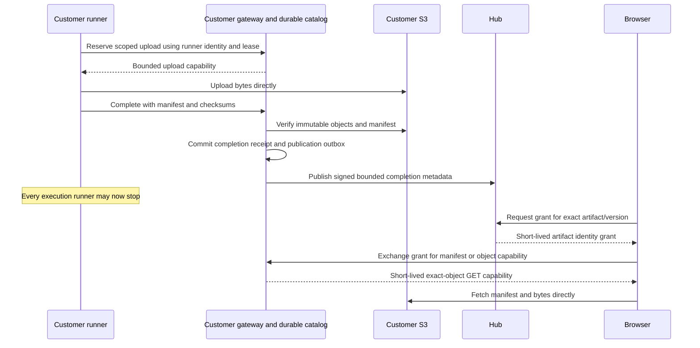

# Offline artifact access contract

[Architecture RFC](cloud-hub-rfc.md#durable-artifacts-and-immutable-changes) · [Design issue #2189](https://github.com/digitaldrywood/detent/issues/2189) · [Delivery #2190](https://github.com/digitaldrywood/detent/issues/2190)

Status: selected technical proposal for review, not implemented behavior or
approved customer onboarding. This document refines the merged #2181 RFC.
Review this contract before #2190 implements delivery; #2192 consumes the same
artifacts for native diff review. Publication completes the design deliverable
without resolving the product decisions below. No accounts, purchases, live
provisioning, DNS, billing, or storage migration are authorized here.

## Decision boundary

Confirmed: Cloud owns collaboration records. Raw source, diffs, transcripts,
logs, screenshots, and video stay on customer infrastructure by default.
Completed uploads remain readable when every execution runner is offline.
Hub must not need customer storage or model-provider credentials to provide
collaboration or authorize an artifact reader.

Recommend **AWS S3 plus a customer-operated API Gateway/Lambda artifact service**
as the first adapter. Lambda issues bounded S3 capabilities using its execution
role; S3 serves the bytes. Customer-owned durable catalog state tracks uploads,
manifests, and publication recovery. This recommendation selects a concrete
protocol to review; it does not make AWS or gateway setup mandatory for customers.

| Open product decision | Proposed direction and implementation boundary | Owner |
| --- | --- | --- |
| Required onboarding | Offer a customer bucket/gateway deployment first. Whether each customer must operate one, may bring an existing service, or can defer artifacts is unanswered. Do not promise offline artifacts with only runner-local files | Human product review; #2190, #2194 |
| Hosted artifact offering | Explicitly optional and disabled by default if approved. No automatic fallback, background copy, free-tier enrollment, or migration to Cloud custody | Human product review; #2193, #2195, #2199 |
| Hosted Hub tenants and hosted storage | Dedicated Hub process/database versus pooled scoped tenants remains open in #2181. Dedicated bucket/account versus shared bucket with enforced organization prefixes, region, operator access, and encryption-key ownership are separate undecided storage choices | Human architecture review; #2193, #2199 |
| Retention and deletion | Operator must select finite artifact, abandoned-upload, tombstone, and backup policies. No product retention duration or recovery objective is approved | Human product/customer review; #2190, #2195, #2197 |
| Cost and service levels | Measure actual usage and select budgets, limits, availability targets, and recovery objectives before commitments. No price, free allowance, or included customer infrastructure is assumed | Human product/customer review; #2195, #2199 |

The numeric protocol ceilings below are review proposals, not existing parser
options, pricing allowances, or approved retention promises. Implement only an
approved deployment path after review. If onboarding or hosted custody remains
unanswered, record that choice on the dependent issue and block the affected
implementation; do not treat this recommendation as customer consent.

## Deployment alternatives

| Dimension | Customer bucket plus gateway (recommended first) | Existing customer authenticated artifact service | Explicitly optional Detent-hosted artifacts |
| --- | --- | --- | --- |
| Setup | Customer deploys private bucket, gateway, roles, durable catalog, issuer trust, browser origins, and retention policy | Customer maps an already durable service to this contract, integrates scoped identity, completion receipts, and browser access; a runner file server does not qualify | Detent operates service/storage only after product approval and explicit organization enrollment |
| Custody | Customer controls storage, gateway, keys, logs, backups, and provider accounts; Cloud sees bounded metadata | Customer's existing provider and access operators have custody under that service's terms; its credentials stay customer-side | Detent and its storage providers receive artifact bytes, manifests, filenames, access capabilities, and backups; this changes the default promise |
| Availability | S3, gateway, catalog, issuer, DNS/network, and any KMS dependency must work; execution runners are irrelevant after completion | Depends on the existing service's independent availability and identity service | Depends on Detent storage and authorization operations as well as Cloud; runner independence still required |
| Browser authorization | Hub issues artifact-scoped identity grant; customer gateway checks it and gives browser a short-lived capability | Service checks mapped organization/project permissions and either accepts the scoped grant or uses its own login plus a binding to current Hub authorization | Hosted service applies the same scopes; storage authority resides with Detent |
| Revocation | Bounded by grants and capabilities below; customer emergency deny controls can reduce exposure | Adapter must prove an equal or stricter bound. A long-lived service session cannot bypass removal from the Detent project | Same bounded semantics required; hosting does not make bearer URLs one-time |
| Cost | Customer pays bucket storage/requests/egress, API/Lambda, catalog, monitoring, optional KMS, backups, and operations | Existing license, API/egress limits, support, and integration cost; no assumption it is already paid for | Requires an approved budget and price model for tenant baseline, storage, downloads, support, deletion, and backups |
| Recovery | Customer restores catalog, manifests, object versions, issuer trust, and policies; durable outbox retries Hub publication | Customer tests service export/restore, missing objects, account transfer, and revoked-user behavior | Detent owns restores and deletion reconciliation; tenant export and isolation need an approved design |

An existing service is conformant only if completed objects are durable without
runners, authorization scopes cannot expand, manifests/integrity and lifecycle
states survive, and browser access works under its actual CORS/login model.
If it cannot satisfy those conditions, report it unsupported. A separate
authenticated customer viewer can be an explicit integration; it is not silently
equivalent to native browser diff rendering.

## Custody and data flow

| Hub metadata allowlist | Customer-only artifact data |
| --- | --- |
| Opaque organization/project/work-item/change/version/run/attempt/artifact/service IDs; artifact kind; schema version; manifest ID/revision/digest; aggregate byte/chunk counts; closed media-type enum; timestamps; upload state; availability reason enum; retention policy ID and expiry; signed completion receipt ID | Manifest contents, filenames, repository-relative paths, object keys/version IDs, source snippets, raw diffs, prompts, transcripts, logs, screenshots, video, credentials, and download/upload capabilities |
| Administrator-approved service origin, issuer identity, public verification keys, protocol/capability versions, and key IDs | Customer storage credentials or role sessions, bucket/KMS/provider secrets, secret-bearing endpoint query strings, authentication headers, and presigned URLs |

Hub stores a manifest **reference and hash**, never the manifest body. Physical
bucket names and object locators stay in the customer catalog. Object keys use
opaque IDs without repository names or filenames; browsers necessarily see their
download host and opaque key. Counts, kinds, timing, hashes, and approved service
domains still disclose activity metadata. Hashes are integrity identifiers, not
anonymization, and may allow correlation or guesses about known content.

Closed event schemas reject arbitrary extra strings and provider error bodies.
Translate customer errors to typed reasons with opaque correlation IDs; detailed
diagnostics stay customer-side. Neither Hub telemetry nor customer gateway/S3
access-log exports sent to Hub may contain content, JWTs, Authorization headers,
or signed query strings. Capability responses use `Cache-Control: no-store`.
Exclude artifact fetch URLs/bodies from analytics, crash reporting, tracing, and
service-worker caches. Share stable authenticated Hub artifact links only.

Issue text, comments, and native reviews are collaboration data stored in Cloud.
A reviewer explicitly pasting code or quoting a diff in a comment sends that
text to Cloud and its configured backups/import/export destinations. Do not
automatically attach code context to an anchor: keep opaque file ID, immutable
artifact/version ID, and line/side numbers in Hub; resolve filenames and snippets
from the customer manifest in the browser. Disclose the custody effect before
submitting explicit quotations; redaction cannot guarantee arbitrary text is
code-free. A customer requiring no source text in Cloud must also govern authored
comments or use customer-hosted collaboration.

Customer storage and encryption reduce automatic custody; they do not establish
that the provider can never access customer code. Cloud controls frontend code
that can read fetched artifacts in a member's browser and dispatch authority that
can instruct runners. Cloud is also a trusted grant issuer in this proposal.
A compromised issuer can mint otherwise valid scoped grants; a compromised UI
can exfiltrate plaintext. Customer-enforced runner policy, limited egress and
credentials, audit, and independently controlled client/identity deployment
reduce these risks. Encryption at rest, including customer-managed KMS keys,
does not remove access available to a permitted decrypting service or browser.

## Browser authorization contract

All endpoints below are proposed protocol operations, not shipped API routes.
The customer registers one exact HTTPS gateway origin and opaque `service_id`
with the Hub, and locally binds that service to approved organization/project
IDs, storage namespaces, Hub issuer, and browser origins. Tenant scope comes from
this configuration and the stored catalog, never a bucket/key supplied by a
browser. Local/self-hosted Hubs use their own issuer and membership authority;
WorkOS or Cloud login is not required.

1. The authenticated browser reads the Hub's immutable Change/artifact reference.
   It requests an artifact read grant through a same-origin POST with normal
   session and CSRF checks. The Hub checks current organization membership,
   project read permission, artifact binding, version, and service binding.
   Billing roles alone grant no artifact access. Organization membership alone
   is insufficient for a private project; cross-organization access is denied.
2. The Hub returns a signed JWT with `typ: detent-artifact-read+jwt`, fixed
   `alg: ES256`, and `kid`. Required claims are exact `iss`, stable user `sub`,
   single `aud` equal to the registered `service_id`, `organization_id`,
   `project_id`, `artifact_id`, immutable `version_id`, `manifest_sha256`,
   `operation: read`, `iat`, `nbf`, `exp`, and random `jti`. Lifetime is at most
   60 seconds. No names, email, filenames, or source content are needed.
3. Browser POSTs to the customer gateway using `Authorization: Bearer` with that
   grant and an opaque manifest/object ID. The gateway validates signature,
   type, fixed algorithm, configured issuer/key, subject shape, exact audience,
   required claims, lifetime, time bounds, operation, and local project binding.
   The catalog must match the artifact/version/hash and contain the requested
   object. Guessing an ID, changing project scope, or selecting another version
   grants nothing. Failed authentication reveals no object existence.
4. Gateway returns an exact-object, exact-version SigV4 GET URL to the browser
   with expiry and required request headers. It cannot authorize PUT, DELETE,
   listing, an arbitrary key, or another artifact. Browser obtains the manifest
   first and requests additional object capabilities as needed; the gateway
   bounds batch size to 32 and validates each object. No bucket credentials or
   role sessions are returned. The Hub never proxies the response or object.
5. Browser fetches directly using `credentials: omit`, with no Hub/gateway token
   forwarded to S3. It checks declared size and SHA-256 before treating content
   as verified evidence. A partial range is not a whole-object hash check; fetch
   and verify the bounded object/chunk before native rendering marks it verified.

Grants express a bounded membership snapshot. The Hub serializes issuance with
membership/project removal against its authoritative state and does not use a
stale positive membership cache. No new grant may be authorized after removal
commits. Existing grants can still be exchanged until expiry. An external IdP
removal must first reach Hub membership; delivery/sync delay is a separate,
visible bound, not included in the artifact revocation promise.

The gateway uses a local JWT verifier, not a default API Gateway authorizer cache
whose TTL could extend access. No positive authorization result outlives a grant.
Grant and capability bodies remain in browser memory, not local storage, Hub
records, query parameters to the gateway, or share links. `jti` enables audit
correlation; it is not a single-use guarantee.

### Issuer trust, key discovery, and rotation

Customer administrators approve the issuer and pin its HTTPS JWKS endpoint during
setup. Do not discover keys from token-controlled `iss`, `jku`, or `x5u` URLs;
do not follow arbitrary redirects. Bind each public key to its issuer, algorithm,
and signing use. Reject unknown algorithms, missing/duplicate claims, malformed
keys, and incompatible token types. Runner enrollment, hosted login, publication
receipts, and browser read grants use distinct types, audiences, and validators.
These choices follow [JWT validation guidance](https://www.rfc-editor.org/rfc/rfc8725.html).

Cache public JWKS for at most 5 minutes. An unknown `kid` triggers one bounded,
rate-limited refresh from the pinned endpoint, then fails closed if unresolved;
never try arbitrary keys or stale keys beyond their cache validity. Normal
rotation publishes the next public key at least 5 minutes before using it and
retains the old key through the last grant's expiry plus clock allowance.
Emergency rotation disables signing with the compromised key, removes it from
JWKS, and pushes a customer gateway key denylist/cache purge where available.
Without that push, a cached compromised key can remain trusted for up to
5 minutes and a forged grant/capability can add the revocation window below.
Declare this larger compromise bound; ordinary member removal does not require
key rotation. Customer operators can disable the issuer/service binding entirely.

If JWKS is unavailable, known keys work only within the finite cache lifetime.
Expired cache, bad clocks, or missing trust fail closed with an authorization
service-unavailable state. Public keys and service configuration must be backed
up with their scope bindings; restored trust must include emergency revocations.

### Download expiry and membership revocation

Proposed grant TTL is 60 seconds; a download URL TTL is at most 60 seconds and
its absolute expiry must never exceed the parent grant's `exp`. Calculate the
remaining lifetime for every exchange and retry, round down, and refuse to sign
if no usable lifetime remains. Temporary-role credential expiry may shorten
the URL further. An expired grant requires a fresh Hub membership check; a
download URL cannot be exchanged for another URL or extended by refresh.

For the review walkthrough, require clocks within 5 seconds of UTC, no positive
expiry leeway, and no authorization caching beyond the above deadlines. A
conservative ceiling is **70 seconds from committed Hub membership/project
removal to rejection of new object requests**, allowing 10 seconds for clock
differences. This bounds new request admission, not erasure of content or
termination of downloads already admitted. Verify the ceiling against the actual
adapter and storage service before claiming it as production behavior. If clock
health or deadline enforcement is unknown, stop issuing capabilities.

[S3 presigned URLs](https://docs.aws.amazon.com/AmazonS3/latest/userguide/using-presigned-url.html)
are reusable bearer capabilities until expiry. S3 evaluates expiry when the
request starts; a running download can continue after expiry, while a new retry
or range request after expiry fails. A removed member who saved bytes, screenshots,
or a URL can retain bytes and reuse the URL within that window. Logout, clearing
the UI, and revoking a Hub session do not recall a URL. No one-time-link claim is
permitted. Customer emergency bucket/role denies or object removal can reduce
exposure but are not a per-user instant-revocation guarantee. Immediate stream
termination would require a separately reviewed proxy/service design and cost.

Every execution runner can be offline throughout these steps. A logged-in user
still needs a reachable Hub to obtain a new grant and a reachable gateway,
catalog, and S3 to download. Hub outage permits only already-issued unexpired
grants/URLs; gateway outage permits only previously issued unexpired S3 URLs.
No fallback contacts the runner or copies bytes into Cloud. Customer administrators
can recover objects using their own storage tools, outside the Hub browser flow;
that is separate audited authority, not an end-user authorization bypass.

### CORS and browser content handling

Configure both gateway and S3 CORS for the exact approved UI origins, including
an explicitly configured self-hosted origin where applicable. Reject `null` and
wildcard origins. Gateway permits preflight and POST with Authorization and
Content-Type; it uses no cross-site cookies. S3 permits GET and only required
headers such as Range, exposes content length/range and checksum headers needed
by the client, and allows no browser write/list operation. Configure HEAD only
if the adapter separately authorizes it; a GET signature does not authorize HEAD.
Use `Vary: Origin` for dynamically selected allowed origins and bounded preflight
caching. [S3 CORS](https://docs.aws.amazon.com/AmazonS3/latest/userguide/cors.html)
controls browser access, not object permission or non-browser requests.

Fetch URLs only from the registered service and its configured HTTPS storage
origins, with redirects disabled. Set `Referrer-Policy: no-referrer`, private
no-store object/capability responses, and `X-Content-Type-Options: nosniff` on
the serving layer where supported. Serve downloads as attachments with a neutral
opaque name; customer filenames appear only after manifest retrieval and safe
display. Render text as text, never HTML. Do not execute uploaded scripts or
render HTML/SVG as active documents. Content-security policy, decoder resource
limits, and text escaping are required in #2192; CORS is not an XSS defense.

## Versioned manifest and upload contract

The customer service assigns random opaque IDs with at least 128 bits of entropy
for artifacts, manifests, uploads, and objects. IDs are identifiers, not secrets
or authorization. An artifact belongs to one organization/project and immutable
Change version or run attempt. Storage paths are constructed server-side from
these IDs. Manifests never provide arbitrary URLs, filesystem traversal targets,
or customer-chosen storage keys for the gateway to fetch or sign.

Schema 1 is a UTF-8 JSON envelope with required fields below. A protocol handshake
reports supported manifest major versions and finite limits. Reject unsupported
major versions or required features; minor versions may add explicitly optional
fields. Reject unknown mutation fields and incompatible states. The Hub's compact
reference has its own versioned schema and must never accept the full manifest.

Initial artifact kinds are `diff`, `log`, `screenshot`, and `video`. Each manifest
describes one kind; mixed evidence links separate artifact IDs. Enforce type and
size limits for that kind and reject unknown kinds. `total_bytes` sums unique
object bytes; the artifact ceiling also includes the stored manifest size.
Manifest revisions and catalog metadata count toward the customer storage
quota. Quotas cannot be bypassed by making revisions.

| Manifest field | Rule |
| --- | --- |
| `schema_version`, `artifact_id`, `manifest_id`, `revision` | Major 1; immutable unique manifest ID; positive monotonically increasing revision per artifact. A digest always addresses exact bytes, not a mutable latest alias |
| `organization_id`, `project_id`, `version_id`, `run_id`, `attempt_id` | Match the reserved upload and authoritative scope; optional run/change fields depend on artifact kind and must not identify a different scope |
| `kind`, `state`, `created_at`, `total_bytes` | Closed kind/state enums, RFC3339 UTC, bounded nonnegative integer byte count checked against entries |
| `objects` | Entries contain opaque object ID, media type, byte size, SHA-256, and customer-only sanitized display filename/path where needed. Physical S3 key/version mapping stays in the catalog |
| `streams` | Log streams contain ordered object IDs, contiguous sequence numbers and byte offsets, per-chunk hashes/sizes, and a final or interrupted marker; no implicit missing chunk |
| `retention_policy_id`, `expires_at` | Match customer policy accepted when reserving; explicit expiry for the artifact, never a URL expiry |

Hash the exact stored manifest bytes with SHA-256; consumers do not parse and
reserialize before checking. Every object's SHA-256 covers the full delivered
uncompressed bytes. Hashes detect corruption/substitution relative to the trusted
reference; they do not prove an agent's output or a test claim is correct. S3
ETag is not the contract's SHA-256. The first adapter uses bounded single-object
PUTs with an explicit SHA-256 checksum that S3 verifies. Do not substitute
multipart composite checksums for a full-object hash; future multipart support
must define and verify both. See [S3 integrity rules](https://docs.aws.amazon.com/AmazonS3/latest/userguide/checking-object-integrity-upload.html).

| Proposed v1 ceiling | Bound and failure behavior |
| --- | --- |
| Manifest | 1 MiB encoded UTF-8, nesting depth 16, at most 1,024 object entries per revision; reject before allocation exceeds limits |
| Diff/text file | 16 MiB per object; larger diffs require an explicitly supported split format or report `size_limit` |
| Log chunk | 1 MiB; immutable contiguous chunks, each independently verified; seal chunks during execution so earlier completed chunks survive a crash |
| Screenshot | PNG, JPEG, or WebP only; 16 MiB per object, at most 16 million decoded pixels |
| Video | MP4 or WebM only; 64 MiB per object; segmented video needs an explicit future capability |
| Artifact total | 256 MiB and 1,024 objects, including all retained chunks in the artifact; stop at the limit with a visible truncation marker |
| Catalog/control request | 1 MiB request body, bounded pagination/batch counts, per-principal rate limits and finite customer-selected storage/upload quotas |

Allowed media types are `text/plain; charset=utf-8`, `text/x-diff; charset=utf-8`,
`application/json` for schema-validated manifests, `image/png`, `image/jpeg`,
`image/webp`, `video/mp4`, and `video/webm`. Reject unknown types, invalid encodings,
and mismatches between declared type and validated format. No archives, executable
HTML, SVG, or compressed content in the first adapter; future types require
reviewed parser/expansion limits. Treat paths as display data, reject traversal,
absolute paths, control characters, and unsafe download filenames. Opaque file
IDs let native review anchor comments without uploading paths to Hub.

### Reservation, completion, and reconciliation

1. Runner authenticates to the customer gateway using a separate, short-lived
   upload grant bound to enrolled runner, organization/project, attempt, lease,
   fencing generation, artifact, and operation. Validate current upload authority
   through Hub before reservation/finalization; expired or superseded attempts
   cannot attach evidence to a newer run. Browser read grants cannot upload.
   Upload grants and PUT capabilities have a proposed maximum of 5 minutes,
   capped at the lease/reservation deadline; renewing them requires a fresh
   authority check. These limits are separate from browser read revocation.
2. Gateway reserves opaque object IDs and declared sizes/checksums under a finite
   quota, records an idempotency key, and issues narrowly scoped PUT capabilities
   with signed checksum/content-type headers. The first adapter uses signed
   [conditional create](https://docs.aws.amazon.com/AmazonS3/latest/userguide/conditional-writes.html)
   (`If-None-Match: *`), S3 versioning, and no runner delete or
   overwrite authority. A replay must not replace completed evidence. Enforce
   declared lengths at the storage request, verify actual sizes at finalization,
   and clean rejected staging objects; gateway quotas alone are not storage limits.
3. Runner uploads directly to storage and submits completion with the manifest.
   Gateway checks every object exists, exact version, size, verified checksum,
   schema/type, scope, and contiguous log ordering. Never trust a runner's success
   boolean, ETag, or its proposed object URL. Customer-side validation workers may
   inspect media; object bytes never go through Hub.
4. Gateway stores the immutable manifest, verifies its checksum, then atomically
   commits catalog completion and an outbox record. A signed completion receipt
   binds issuer/service, organization/project, artifact/version/attempt, manifest
   ID/revision/hash, aggregate size/kind/state, expiry, and unique receipt ID.
   It is an integrity assertion, not a read capability. Hub accepts receipts only
   from administrator-registered customer service keys and matching reserved scope.
5. Customer service retries metadata publication independently of runners using
   that receipt and durable outbox. Hub deduplicates receipt IDs; same key with
   different content conflicts. A lost response is safe to replay. Stale attempts
   may retain their own evidence but cannot satisfy a current version's gates.
   Reconcile orphaned finalized receipts through a scoped metadata API without
   fetching manifests into Hub. Receipt key rotation preserves historical
   verification independently of short-lived browser grant keys.

Read and write roles are separate from publication identity and cleanup authority.
The customer deployment uses distinct Lambda execution roles/functions for read
signing, upload/finalization, and deletion so a read path cannot mint write URLs.
Completion checking and outbox state must be durable before acknowledging upload
completion. A bucket write alone is insufficient. If a runner dies after bytes
arrive but before finalization, the catalog reconciler may finalize only when all
reserved inputs and validated manifest are present; otherwise publish a partial
or abandoned state. Never infer a complete diff from a subset of files.

For live logs, publish an immutable partial manifest revision only after each
referenced chunk is durably verified. A final revision names the full contiguous
stream and terminal marker; previous revisions remain immutable. Customer expiry
of an abandoned attempt can seal an interrupted stream from known verified
chunks. The Hub may advance a latest-revision pointer with a monotonic check;
reviews pin a specific manifest digest/revision. Reusing unchanged chunk objects
does not double-count the artifact quota; deletion accounts for references from
all retained revisions before removing shared chunks.

### Availability, retention, and deletion

Upload state and current availability are separate: a completed upload does not
become an upload failure because a gateway is temporarily down. Hub availability
is a last-observed value with a timestamp; browser reads still check customer
service state. Per-user denial is not a global artifact failure.

| State or reason | Required behavior |
| --- | --- |
| `reserved`, `uploading` | Pending; never review-ready. Report bounded progress metadata without content |
| `partial`, `interrupted` | Offer only verified uploaded log chunks with visible missing/finalization status; partial diffs cannot pass review gates |
| `complete` / `available` | Durable receipt accepted and objects verified; consumer still verifies the pinned hash |
| `failed` / `size_limit`, `invalid_manifest`, `checksum_mismatch` | Explicit failed upload or corrupt evidence; retry under a new immutable reservation/revision where needed, never silently replace pinned bytes |
| `unavailable` / `gateway_unreachable`, `storage_unreachable`, `authorization_unavailable` | Metadata/discussion remain readable; bounded backoff with retry guidance, no claim that runner restart repairs it |
| `denied` | Per-request authorization failure; do not expose object existence across project/tenant boundaries or globally mark the artifact missing |
| `missing` | Authorized lookup establishes that an expected object/version is absent; distinguish it from provider 403/timeout. Retry/reconcile or restore exact bytes; no empty-success response |
| `expired`, `deletion_pending`, `deleted` | Retention reached, physical cleanup in progress, or verified deletion; retain permitted tombstone metadata and truthful backup status |

Customer policy defines retention from finalized artifact creation (or the
reservation deadline for abandoned uploads), including partial log revisions,
staging objects, old S3 versions, incomplete multipart uploads if later supported,
catalog entries, receipts, tombstones, logs, and backups. Do not reset retention
by reading, retrying publication, or creating a revision. A policy change requires
authorized customer action; shortening retention shows the new expiry and pending
deletion before claiming bytes are gone. Customers select durations during setup;
there is no implied indefinite retention or product default in this proposal.

The gateway rejects grants/capabilities for expired or tombstoned artifacts and
caps URL expiry at artifact expiry too. A delete request requires separate
organization/project delete permission, persists a tombstone before cleanup,
and prevents new issuance. Existing read capabilities obey the same admission bound;
already downloaded bytes cannot be deleted remotely. A worker removes all
applicable object versions and unreferenced chunks, then confirms absence and
updates `deleted`. Outstanding PUT capabilities have their separate upload TTL;
stop renewals, account for admitted writes, and reconcile objects again after
those writes finish before confirming deletion. Conditional create alone does
not prevent recreation after a delete marker. Keep `deletion_pending` until
late writes are fenced or cleaned, and never allow them to clear the tombstone.
Lifecycle automation is a cleanup aid, not proof of prompt
deletion. Object Lock/legal holds, backup retention, or denied delete authority
must be disclosed as outstanding deletion state, never a false success.

Backups include catalog, manifests, outbox, receipt-verification keys, scope/issuer
configuration, and object versions under customer policy. Restore reapplies a
durable deletion ledger before enabling reads or replaying completion events;
restoration must not resurrect revoked trust, membership, expired data, or deleted
artifacts. Define backup expiry and test restoring exact digests before offering
a recovery objective. If exact content is unrecoverable, retain `missing`;
regenerated content becomes a new artifact/version and does not inherit reviews.

Deleting Hub metadata alone does not prove customer object deletion. Hub sends a
scoped deletion request to the customer service, tracks its receipt/progress,
and reports unreachable service or customer cleanup requirements. Organization
offboarding must inventory and request customer deletion before losing the
binding needed to track it. Export carries bounded Hub references separately
from a customer-authorized artifact export; never embed capabilities in exports.

## First adapter and minimal operator walkthrough

This is a proposed deployment checklist for an approved pilot, not an executable
installer or a request to create resources now. API routes, role policies, and
deployment packaging belong to #2190 after contract/product review.

1. Record customer approval for this deployment, organization/project bindings,
   region, exact Hub/UI origins, issuer/JWKS, retention and abandoned-upload
   deadlines, backup policy, quotas, and budget. Decide whether the customer has
   an AWS account and can operate the gateway; do not purchase one on their behalf.
2. In that customer account, deploy a private versioned S3 bucket with public
   access blocked, TLS required, encryption at rest, and policies limiting read,
   conditional create, verification, and cleanup to the separate roles. If KMS
   is selected, constrain and budget its permissions/requests. Pin immutable
   object versions and use opaque namespace keys. Configure lifecycle cleanup
   to match the agreed retention policy rather than a hidden fixed duration.
3. Deploy HTTPS API Gateway plus Lambda handlers, a customer-owned DynamoDB
   catalog/outbox with [conditional transactions](https://docs.aws.amazon.com/amazondynamodb/latest/developerguide/transactions.html),
   and a scheduled reconciler. Store manifest bytes in S3; catalog items contain
   bounded references, not a manifest-sized database item.
   This catalog is artifact-service state; it does not change the Hub's
   single-owner SQLite contract. Give Lambda [workload execution roles](https://docs.aws.amazon.com/lambda/latest/dg/lambda-intro-execution-role.html) limited
   to the required bucket/project scope and catalog operations. Configure rate
   limits, request size enforcement, time synchronization health, redacted logs,
   alarms, backups, and the issuer key cache policy.
4. Register the customer service origin and public receipt keys with the Hub;
   configure exact Hub issuer/audience and organization/project bindings locally
   at the gateway. Use customer-controlled configuration changes, not values
   accepted from job code or an arbitrary JWT. Establish separate upload,
   publication, and browser-read trust. Test wrong issuer, audience, project,
   token type, missing/expired key, and forged completion before enabling access.
5. Configure exact browser origins in gateway and S3 CORS and storage origins
   in the browser policy. Verify both preflight and actual authenticated fetch
   from the approved UI. An unapproved origin must fail in a browser; direct
   non-browser requests must still need valid authorization.
6. Configure runners for gateway-mediated upload. They need their scoped Detent
   identity, not an AWS key. AWS-hosted gateway workloads use execution-role
   temporary credentials. If an approved direct-uploader mode is later needed,
   AWS roles or workload federation may supply temporary credentials; external
   machines need a supported identity source/trust setup such as OIDC or Roles
   Anywhere. No generic S3-compatible vendor STS/OIDC support is assumed.
7. Upload a small diff and multi-chunk log, verify completion receipt and Hub
   metadata, then use the offline/revocation scenarios below. Confirm Hub logs,
   database, analytics, and export contain no URLs, paths, snippets, or credentials
   from artifact delivery. Authored review text is checked separately.
8. Test customer catalog/object restore and deletion reconciliation, record actual
   request/egress/storage usage, and review cost/availability evidence before
   expanding beyond the pilot. Document the operator's recovery and key rotation
   procedures alongside the deployment.

[AWS IAM guidance](https://docs.aws.amazon.com/IAM/latest/UserGuide/best-practices.html)
recommends temporary workload credentials and least privilege. Permanent keys,
when unavoidable for another storage provider, belong in the customer's gateway
secret store with rotation and narrow scope; they never enter Hub configuration
or metadata. S3 API compatibility alone does not establish equivalent identity,
conditional-write, checksum, CORS, or expiry behavior. Each later adapter must
advertise and test its actual capabilities or be rejected for this contract.

Cost remains unmeasured: estimate retained bytes and versions, log generation
rate, retries, average views/chunks/ranges per review, cross-region/internet
egress, PUT/GET/HEAD and catalog operations, Lambda invocations/duration, API
requests, key operations, logs, backups, deletion, and support. Serverless does
not imply zero baseline or free downloads. Hosted tenants add idle Hub/process
memory and database/backup cost; pooling changes isolation and engineering cost.
No provider price quote, margin, free storage promise, or availability SLA follows
from this design. Choose account/region and collect usage before pricing approval.

## Threat and data-flow review

The control/data separation is analogous to the
[Tailscale control and data plane distinction](https://tailscale.com/docs/concepts/control-data-planes),
not a claim that Detent inherits Tailscale's security or availability properties.
This design still trusts the Hub's scope decisions and the customer gateway.

| Threat or boundary crossing | Contract control and residual risk |
| --- | --- |
| Removed user replays a grant or URL | Fresh Hub issuance checks committed membership; parent expiry caps URLs; 70-second new-request ceiling under stated clock assumptions. Cached/active downloads remain outside revocation |
| Cross-project or tenant substitution | Exact issuer/audience/operation and catalog scope/version/hash check; browser cannot choose keys, roles, tenants, or discovery URLs |
| Grant issuer or signing key compromised | Fixed trust configuration, finite key caches, rotation/deny procedures, customer service shutdown. Trusted issuer compromise can still authorize content; cache plus grant window enlarges exposure |
| Malicious runner uploads substituted or oversized evidence | Fenced reservation, conditional immutable writes, verified checksum/type/length, bounded quotas, completion receipt. Customer-run output is still untrusted evidence about task correctness |
| Crash between object upload and Hub publication | Durable customer catalog/outbox, idempotent receipts, partial-state reconciliation; runner heartbeat is not a read dependency |
| URL leaks through history, telemetry, shared cache, or referer | Header-based exchange, no-store, no-referrer, redacted logs and opaque keys. Copied URLs remain usable during their lifetime |
| Malicious diff, path, media, or manifest | Hash checks, schema/type/size limits, safe filename handling, text rendering and no active document types; rendering still requires its own security tests |
| Cloud frontend/dispatch compromise | Customer-controlled execution policy and egress reduce exposure; encryption and no stored bucket keys cannot establish provider inability to access content |
| Restore or stale event resurrects deleted evidence | Deletion ledger precedes read enablement; monotonic versions and idempotent publication cannot clear tombstones; physical backup expiry remains separately visible |

## Validation walkthroughs and delivery gate

These are step-by-step design traces and required implementation acceptance
scenarios, not claims that an AWS deployment was exercised for this documentation
change. Record document review and `make check` results in the issue Workpad.
Production UI verification is N/A here; delivery and rendering follow-ups own
live adapter/browser tests after approval.

### All execution runners offline

1. Reserve and upload a diff plus three log chunks; verify sizes/hashes and commit
   immutable manifest M1, receipt R1, and outbox in the customer service.
2. Simulate a lost Hub acknowledgment and stop every execution runner. The
   customer reconciler replays R1; Hub deduplicates it and marks the artifact
   complete exactly once. A stopped runner never signs a read URL.
3. A permitted project member opens the immutable Change version in Hub, gets a
   60-second grant, exchanges it at the customer gateway, and downloads M1 and
   its objects from S3. Hashes and ordered chunks match the pinned reference.
4. Expire the URL and retry. A fresh Hub grant and customer gateway exchange
   restore access without a runner. Repeat with Hub down: no fresh grant; cached
   capabilities work only until their original deadlines.
5. With gateway down, show metadata and a typed access failure; with an expected
   object removed, show `missing` after an authorized existence check. Neither
   case becomes an empty diff, a successful evidence gate, or Cloud fallback.

### Membership revocation

1. Enroll a reader in organization O and private project P. Confirm that another
   project member without P access cannot request the artifact, even knowing IDs.
2. Issue a grant immediately before revocation and exchange one object URL.
   At time T0, commit removal from P in Hub's authoritative membership state.
3. Fresh grant requests now fail. Replay the old grant near its deadline; any
   resulting URL expires no later than that grant, not 60 seconds after exchange.
   Existing URLs may still work within the original deadline. UI logout alone
   is not considered revocation evidence.
4. After T0 + 70 seconds, new GET/range/retry requests using saved grants and URLs
   fail under the stated clock bounds. A stream started before its deadline may
   finish; locally saved bytes remain readable. Do not assert those bytes vanished.
5. Repeat for organization removal and user session revocation. For external
   identity removal, record the IdP-to-Hub propagation delay separately. Repeat
   with worst allowed clock skew and a cached gateway key to prove the bound.
6. Exercise a compromised key rotation separately: measure JWKS cache expiry,
   customer deny propagation, and outstanding URL expiry. Do not use the ordinary
   70-second membership number as the full key-compromise revocation bound.

### Integrity, failure, recovery, and custody

1. Reject altered manifest hash, wrong object version/checksum, duplicate/reordered
   log sequences, unsupported schema/type, cross-project receipt, and oversized
   upload. A correct hash of malicious content still requires safe rendering.
2. Crash before manifest finalization: retain only verified partial chunks, show
   interruption, and clean abandoned staging under policy. Crash after durable
   completion: replay the outbox independently and preserve pinned versions.
3. Retry the same receipt and completion request; observe idempotence. Reuse the
   key with changed payload or attach an old attempt to a new head; observe denial.
4. Delete an artifact, restore an older backup, and replay an old completion.
   Tombstones prevent renewed access; confirm all object versions are removed
   before declaring deletion complete and report remaining backup retention.
5. Inspect Hub metadata/export and access telemetry after download: opaque
   references only, no manifest body, source paths, contents, storage credentials,
   or bearer URLs. Submit an explicit code quote in a review comment and verify
   it is stored as disclosed collaboration content, not misreported as outside Cloud.
6. Exercise normal key rotation, unknown `kid`, wrong audience/type, CORS failure,
   expired keys, and interrupted storage access. Fail closed without contacting
   runners or automatically selecting hosted storage.

Before #2190 implementation, reviewers must accept or revise the proposed
protocol ceilings, trust/expiry rules, first deployment, and completion/lifecycle
semantics. Record answers to the open product decisions separately. This design
can be reviewed and merged while a dependent deployment choice remains open;
that choice must remain visibly unresolved on the dependent implementation.
