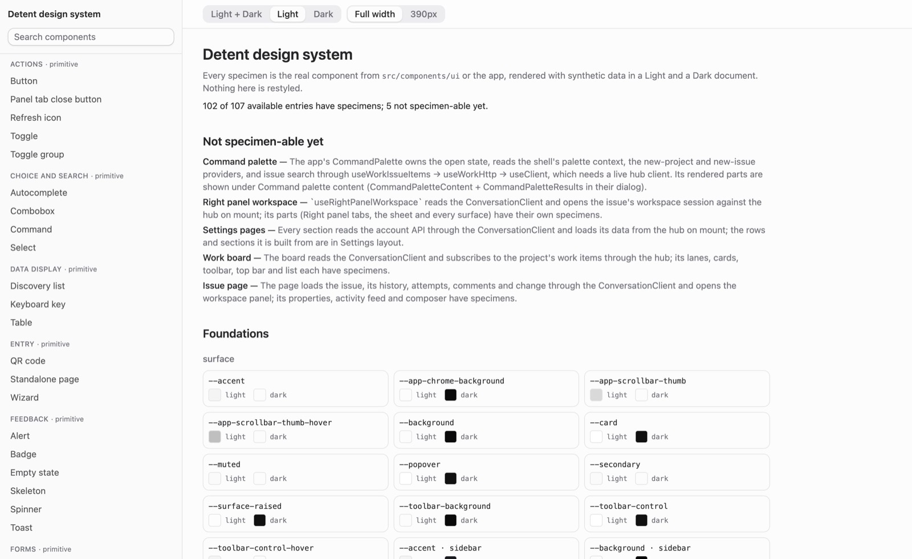
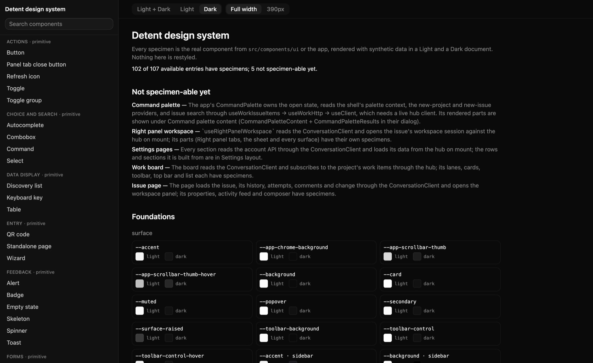
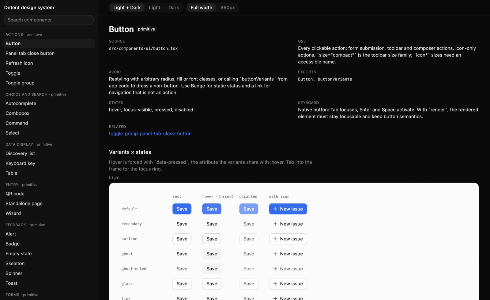
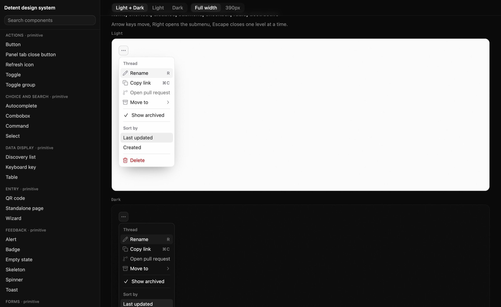
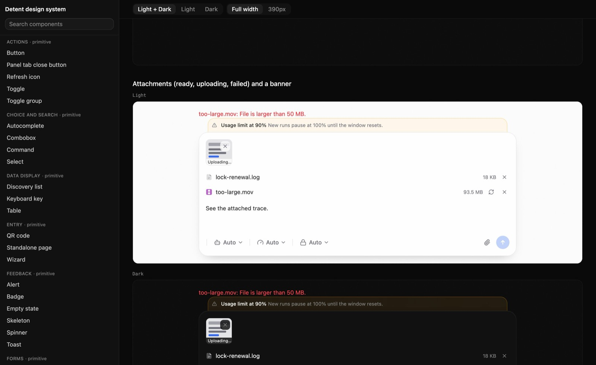
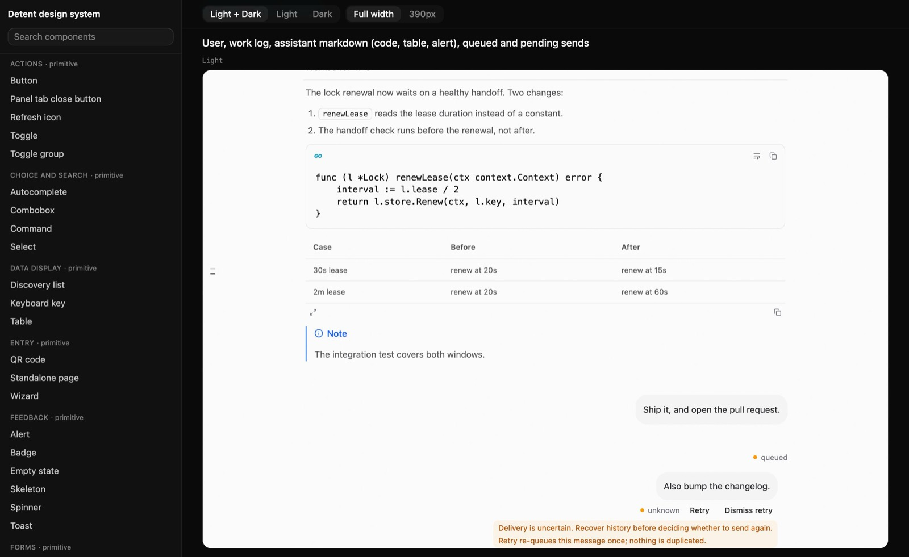
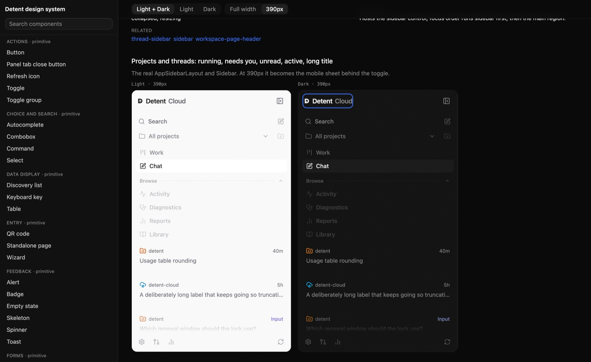

# Detent design system

This is the reference for Detent's Cloud UI (`web/conversation`) and the base that future UI work builds from. It documents and verifies what the client contains: the tokens in its two stylesheets, the primitives in `src/components/ui`, and the compositions built from them. Shared primitives and compositions own their appearance and behaviour; features compose them and connect them to data through adapters, and do not restyle them. A visual change is a scoped decision made in the owning stylesheet or component.

Consistent output comes from choosing the same component and composition for the same task. Select from this system before styling a screen. Product behaviour and the [repository invariants](../invariants.md) remain authoritative.

## Contents

- [Foundations and token ownership](foundations.md): colour roles, type, spacing, radius, motion and elevation, generated from the stylesheets.
- [Color review](color-review.md): measured contrast of the colour tokens.
- [Brand in product UI](brand.md): the mark, interface voice and the separate sign-in and Templ surfaces.
- [Component contracts](components.md): import, variants, states, keyboard, use and avoid for every catalogued component, grouped by family. Generated.
- [Element catalog](element-catalog.md): one table of every entry with its group, kind, status and source. Generated.
- [Patterns](patterns.md): screen and composition recipes, control selection, feedback and interaction states.
- [Accessibility](accessibility.md): contrast, target size, focus and review criteria.
- [Contributing](contributing.md): how to add or change a component and keep the catalog current.
- [Migration](migration.md): adoption gaps and known exceptions.
- [Workpad](workpad.md): progress and validation record for the design-system build.

The development gallery renders every catalogued component with synthetic data at `/design-system` in the Vite dev server (`npm run dev` in `web/conversation`). It reads the same catalog as the generated docs. [Contributing](contributing.md#run-the-gallery) shows how to run it against the mock hub.

## Gallery

Each specimen renders the real component in separate Light and Dark documents, at full width or 390px.

| Overview, Light | Overview, Dark |
| --- | --- |
|  |  |

| Button variants and states | Menu, open in both themes |
| --- | --- |
|  |  |

| Composer with attachments | Conversation timeline |
| --- | --- |
|  |  |

| App sidebar at 390px |
| --- |
|  |

## Sources of truth

| Concern | Owner |
| --- | --- |
| Semantic tokens | [`src/app/global.css`](../../web/conversation/src/app/global.css) (semantic roles and themes) and [`src/app/index.css`](../../web/conversation/src/app/index.css) (fonts, primary colour and the sign-in surface) |
| Primitives | [`src/components/ui`](../../web/conversation/src/components/ui) |
| Compositions | `src/components/**` (shared compositions) and `src/app/**` (screens and data adapters) |
| Component catalog | [`src/design-system/catalog.json`](../../web/conversation/src/design-system/catalog.json) |
| Screen coverage | [Design inventory](../conversation/design-inventory.md) |
| Product behaviour | [Product decisions](../conversation/decisions.md) |

When the inventory's historical styling examples differ from this system, use this system for visual rules and the existing implementation for behaviour. The public sign-in surface and the local Templ dashboard keep their own current contracts (see [Brand](brand.md)).

## The catalog

`catalog.json` has one entry per primitive, composition and surface. Each entry records its group, status (`available`, `proposed` or `exception`), source file and exports, the variants its source defines, the states it owns, keyboard behaviour, when to use it and what to use instead.

`npm run design:catalog` in `web/conversation` validates the catalog and regenerates [components.md](components.md) and [element-catalog.md](element-catalog.md). Validation fails when an id repeats, a source is missing, a listed export is not exported, a catalogued variant differs from the `cva` definition, or a file in `src/components/ui` has no entry. `npm run design:catalog:check` also fails when the generated docs are stale.

## Design decisions

1. Reuse an existing primitive first. Its public props own appearance and behaviour; callers own placement and layout.
2. Use semantic roles for surfaces, text, actions, feedback and selection. A brand action and a successful outcome have different roles.
3. Keep workspace chrome compact. Let reading content, forms on phones and touch hit areas have the space they need.
4. Prefer rows, separators and existing panels. Use cards for grouped entities or consequential inline requests, not to wrap every section.
5. Preserve the whole composition of the composer, sidebar and right panel. Their attached surfaces and responsive behaviour are part of the design.
6. Keep typography, icons, spacing and state treatments consistent across features. Exceptions belong to named components.
7. Keep useful labels and keyboard focus visible. A tooltip supplements an action; it cannot supply its only accessible name.
8. Shared owners, not local copies. Primitives and compositions are the owners of their look and behaviour. A feature composes them through props and adapters; it never forks or restyles one. A genuinely missing component is added once to the shared library and catalogued.

The system uses a Zinc-based neutral palette, Lucide icons, Base UI interaction primitives, `class-variance-authority` and Tailwind v4. Adopting these rules does not require regenerating components or upgrading dependencies.

## Accessibility baseline

Ordinary text meets 4.5:1 contrast and qualifying large text 3:1 against the resolved surface; token values alone do not prove it, especially with opacity, glass or imported themes. Targets meet WCAG 2.2's 24 by 24 CSS pixel minimum or its spacing exceptions; touch controls aim for 44 by 44 effective pixels without overlapping hit areas. Preserve semantic controls, associated labels, visible focus, keyboard navigation, focus return from overlays, text or icon alternatives to colour, and non-hover access to essential actions. [Accessibility](accessibility.md) holds the full criteria.

## Agent instructions

Use the following with an authorized Detent UI task:

```text
Use the Detent design system (docs/design-system/README.md) and the existing
component library. First read AGENTS.md, the relevant invariants, the target
component's contract in docs/design-system/components.md and its closest
existing screen. Identify the authorized UI scope, the pattern
(docs/design-system/patterns.md), semantic colour roles, component variants
and required interaction states.

Reuse web/conversation/src/components/ui primitives and the existing shell,
composer, settings and surface compositions. Use props for primitive
appearance; use className for placement and layout. Keep compact toolbar
controls in one size family. Use semantic text and surface utilities, system
font tokens, existing icon mappings and shared header and sidebar geometry.

Do not invent a new palette, tooltip, menu, composer, card layout or status
mapping for one feature. A component the library lacks is added once to the
shared library (src/components/ui or src/components) and to
src/design-system/catalog.json; run npm run design:catalog.
Existing specialized renderer contracts and Detent-specific data and
interaction behaviour remain authoritative.

Implement only the UI named by a human-authored issue where INV-15 requires it.
Honor INV-13 card content and INV-16 publication ownership. File product work
through the supported selected tracker unless manual implementation is
explicitly authorized. Do not add enforcement mechanisms or validation gates.

Review both themes, narrow containers, long labels, keyboard focus, touch hit
areas, and existing loading, empty, error and disabled states. Report the
actual components reused, source references and any unresolved visual
exception in the authorized Change or issue outcome.
```

## Applying the system

For a requested UI change, identify its pattern and choose the smallest set of available components that expresses it. The catalog distinguishes available components from proposed ones. Preserve existing behaviour, permission checks and renderer contracts while aligning appearance through the shared owners.

A proposed width, layout or component is not permission to add a surface or perform a broad redesign. Scope product changes through the selected tracker and follow [INV-13](../invariants.md#inv-13--a-board-card-is-a-title-and-one-status-line), [INV-15](../invariants.md#inv-15--visible-ui-changes-require-a-human-authored-issue) and [INV-16](../invariants.md#inv-16--the-tracker-database-is-the-only-shared-knowledge-channel). Keep change-specific evidence and unresolved exceptions in the authorized Change or issue outcome, not in these documents.
